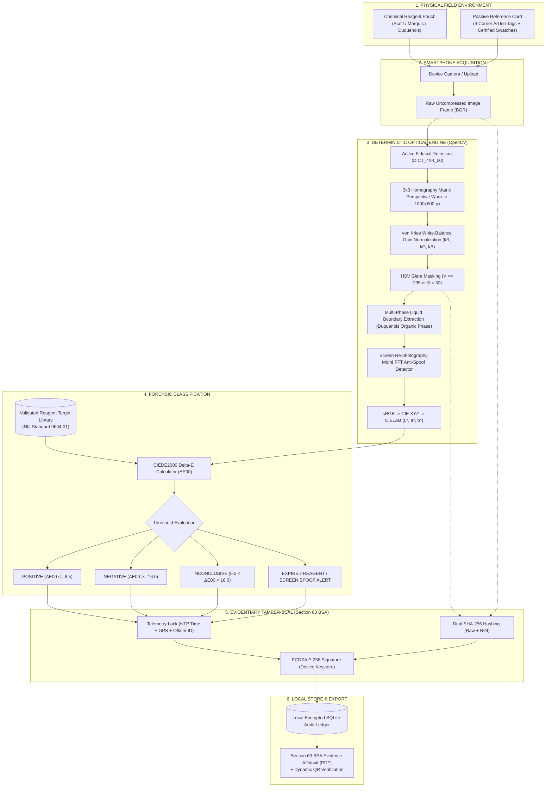

# 🛡️ FieldVerify AI: Digital Companion for Field Drug Testing

> **Official Competition Metadata:**
> * **Hackathon:** Smart India Hackathon (SIH 2026)
> * **Problem Statement ID:** `SIH26231`
> * **Sponsoring Agency:** Ministry of Home Affairs (MHA) / Narcotics Control Bureau (NCB)
> * **Category / Theme:** Software / Law Enforcement, Forensic Technology, MedTech

---

## 📑 Table of Contents
1. [Executive Summary & Zero-AI Philosophy](#1-executive-summary--zero-ai-philosophy)
2. [High-Level Design (HLD) & System Architecture](#2-high-level-design-hld--system-architecture)
3. [Low-Level Design (LLD) & Mathematical Formulas](#3-low-level-design-lld--mathematical-formulas)
4. [Officer Field Interaction Sequence Diagram](#4-officer-field-interaction-sequence-diagram)
5. [End-to-End Function Call & Execution Trace](#5-end-to-end-function-call--execution-trace)
6. [User Guide: How to Use the Prototype Step-by-Step](#6-user-guide-how-to-use-the-prototype-step-by-step)
7. [How to Read & Interpret the Section 63 BSA PDF Affidavit](#7-how-to-read--interpret-the-section-63-bsa-pdf-affidavit)
8. [Pre-Generated Demo Datasets & Synthetic Test Images](#8-pre-generated-demo-datasets--synthetic-test-images)
9. [Execution Commands (Local & Shared Wi-Fi Mobile Mode)](#9-execution-commands-local--shared-wi-fi-mobile-mode)
10. [Automated Test Suite](#10-automated-test-suite)

---

## 1. Executive Summary & Zero-AI Philosophy

Field officers (Police, NCB, Border Security) use chemical test kits (Scott, Marquis, Duquenois-Levine) to test suspected roadside drugs. Currently, officers rely on visual color interpretation under streetlights or ambient light, producing **subjective results**, **no contemporaneous proof**, and **judicial vulnerability in court**.

**FieldVerify AI** is a zero-hardware, deterministic digital companion app that:
1. Uses a **passive credit-card-sized reference card** (costing ₹10) with 4 corner ArUco fiducials and calibrated color swatches (95% White, 18% Gray, 5% Black).
2. Runs **deterministic classical computer vision (OpenCV)**:
   * 4-point perspective homography warp into a $1000 \times 600\text{ px}$ canvas.
   * Per-channel **von Kries reference white-point gain normalization** ($k_R, k_G, k_B$) to eliminate ambient light tint (fluorescent, sodium streetlights, or sunlight).
   * **HSV specular glare masking** to filter out shiny plastic reflections.
   * **Multi-phase liquid boundary extraction** for two-layer reactions (e.g. Duquenois-Levine test for Cannabis/THC).
   * **Screen re-photography Moiré pattern FFT anti-spoofing** to detect fake photos shot off a phone/laptop screen.
   * **CIEDE2000 ($\Delta E_{00}$) perceptual color distance calculation** against certified presumptive reaction color profiles (NIJ Standard 0604.01).
3. Provides **cryptographic tamper-evident sealing**:
   * Computes `SHA-256(Raw Frame)` and `SHA-256(Calibrated ROI)`.
   * Binds UTC NTP timestamp, GPS location, Officer Badge ID, and Reagent Lot Number.
   * Signs payloads using **ECDSA P-256 (`SECP256R1`)** hardware key signatures.
   * Generates a 1-page statutory court evidence PDF affidavit compliant with **Section 63 of the Bharatiya Sakshya Adhiniyam (BSA), 2023**.

---

## 2. High-Level Design (HLD) & System Architecture



---

## 3. Low-Level Design (LLD) & Mathematical Formulas

### 3.1 Perspective Homography Rectification
Let corner ArUco marker centers be $P_{\text{src}} = [C_0, C_1, C_2, C_3]$ and destination points be $P_{\text{dst}} = [(0, 0), (1000, 0), (1000, 600), (0, 600)]$.
The $3 \times 3$ perspective transformation matrix $H$ satisfies:
$$\begin{bmatrix} x' \\ y' \\ 1 \end{bmatrix} = H \begin{bmatrix} x \\ y \\ 1 \end{bmatrix}, \quad I_{\text{rectified}} = \text{cv2.warpPerspective}(I_{\text{raw}}, H, (1000, 600))$$

### 3.2 von Kries White-Point Chromatic Gain Calibration
Sample the known White Patch ROI on the rectified card (reflectance $\approx 95\%$, target RGB $= 242.0$):
$$\bar{R}_{\text{meas}}, \bar{G}_{\text{meas}}, \bar{B}_{\text{meas}} = \text{mean of pixels in White Patch}$$
$$k_R = \frac{242.0}{\max(\bar{R}_{\text{meas}}, 1.0)}, \quad k_G = \frac{242.0}{\max(\bar{G}_{\text{meas}}, 1.0)}, \quad k_B = \frac{242.0}{\max(\bar{B}_{\text{meas}}, 1.0)}$$
Apply per-channel chromatic adaptation to the reaction ROI:
$$R_{\text{calib}} = \min(255, R \cdot k_R), \quad G_{\text{calib}} = \min(255, G \cdot k_G), \quad B_{\text{calib}} = \min(255, B \cdot k_B)$$

### 3.3 CIEDE2000 Color Difference ($\Delta E_{00}$)
Converts sRGB $\rightarrow$ CIE $XYZ \rightarrow \text{CIELAB } (L^*, a^*, b^*)$.
The CIEDE2000 formula calculates non-linear perceptual distance:
$$\Delta E_{00} = \sqrt{\left(\frac{\Delta L'}{k_L S_L}\right)^2 + \left(\frac{\Delta C'}{k_C S_C}\right)^2 + \left(\frac{\Delta H'}{k_H S_H}\right)^2 + R_T \left(\frac{\Delta C'}{k_C S_C}\right)\left(\frac{\Delta H'}{k_H S_H}\right)}$$

---

## 4. Officer Field Interaction Sequence Diagram

```mermaid
sequenceDiagram
    autonumber
    actor Officer as Field Police Officer
    participant App as app.py (Streamlit Web Dashboard)
    participant Opt as fieldverify/core/optical.py
    participant Reagent as fieldverify/core/reagent.py
    participant Crypto as fieldverify/core/crypto.py
    participant DB as fieldverify/core/db.py
    participant PDF as fieldverify/core/pdf_generator.py

    Note over Officer,App: Phase 1: On-Scene Setup & Telemetry Input
    Officer->>App: Input Badge ID, FIR Case Ref, Location, GPS, Reagent QR
    App->>Reagent: parse_reagent_qr_data(qr_payload)
    Reagent-->>App: Reagent validated (Lot SC-2026-0819, Expiry OK)

    Note over Officer,Opt: Phase 2: Frame Acquisition & Calibration
    Officer->>App: Upload/Capture camera photo & click "Run Analysis"
    App->>Opt: detect_screen_spoofing(image_bgr)
    Opt-->>App: is_spoof = False (Authentic physical sample)
    App->>Opt: rectify_reference_card(image_bgr)
    Opt-->>App: Rectified card (1000x600 px)
    App->>Opt: calibrate_and_extract_color(rectified, is_multi_phase)
    Opt-->>App: Calibrated ROI + Measured LAB (29.8, 1.9, -51.2) + Glare %

    Note over App,Crypto: Phase 3: CIEDE2000 & Cryptographic Sealing
    App->>Opt: ciede2000(measured_lab, target_lab)
    Opt-->>App: ΔE00 = 1.84 (Outcome: POSITIVE FOR COCAINE)
    App->>Crypto: generate_evidentiary_certificate(raw_bytes, roi_bytes, metadata)
    Crypto->>Crypto: SHA-256(raw) + SHA-256(roi) + ECDSA P-256 Sign
    Crypto-->>App: Signed Certificate JSON + Signature Hex

    Note over App,PDF: Phase 4: Storage & Court Affidavit Export
    App->>DB: save_test_record(cert)
    DB-->>App: Record saved in SQLite ledger
    App->>PDF: generate_evidentiary_pdf(cert)
    PDF-->>Officer: 1-Page Section 63 BSA Court Evidence PDF + Dynamic QR
```

---

## 5. End-to-End Function Call & Execution Trace

Below is the exact execution trace showing every function call across all files from user action to PDF export:

```
[USER ACTION: Click "Run Calibrated Analysis" in app.py]
  │
  ├── 1. `app.py` (Line 160)
  │      └── Calls `fieldverify.core.reagent.parse_reagent_qr_data(qr_json_str)`
  │             └── File: fieldverify/core/reagent.py (Line 42)
  │             └── Returns: `{"is_valid": True, "is_expired": False, "reagent_type": "SCOTT_REAGENT", ...}`
  │
  ├── 2. `app.py` (Line 197)
  │      └── Calls `fieldverify.core.optical.detect_screen_spoofing(input_image_bgr)`
  │             └── File: fieldverify/core/optical.py (Line 115)
  │             └── Computes: 2D FFT Moiré spectrum & Laplacian variance
  │             └── Returns: `(is_spoof=False, score=142.5, reason="Physical sample authentic")`
  │
  ├── 3. `app.py` (Line 200)
  │      └── Calls `fieldverify.core.optical.rectify_reference_card(input_image_bgr)`
  │             └── File: fieldverify/core/optical.py (Line 148)
  │             └── Runs: OpenCV `ArucoDetector` for ArUco markers 0, 1, 2, 3
  │             └── Runs: `cv2.getPerspectiveTransform()` & `cv2.warpPerspective()`
  │             └── Returns: `rectified_img` (1000x600x3 BGR numpy array)
  │
  ├── 4. `app.py` (Line 206)
  │      └── Calls `fieldverify.core.optical.calibrate_and_extract_color(rectified, is_multi_phase)`
  │             └── File: fieldverify/core/optical.py (Line 185)
  │             └── Samples: White swatch ROI (x=150, y=450, w=80, h=80)
  │             └── Computes: von Kries gains `k_R, k_G, k_B`
  │             └── Samples: Pouch reaction ROI (x=450, y=150, w=300, h=300)
  │             └── Masks: Specular glare `(V >= 235 or S < 30)`
  │             └── Converts: BGR -> CIE XYZ -> CIELAB via `srgb_to_lab()` (Line 79)
  │             └── Returns: `{"calibrated_pouch": crop, "measured_lab": (29.8, 1.9, -51.2), "glare_percentage": 2.1, ...}`
  │
  ├── 5. `app.py` (Line 213)
  │      └── Calls `fieldverify.core.optical.ciede2000(measured_lab, target_lab)`
  │             └── File: fieldverify/core/optical.py (Line 18)
  │             └── Calculates: CIEDE2000 perceptual distance formula
  │             └── Returns: `delta_e = 1.84` (Outcome: "POSITIVE")
  │
  ├── 6. `app.py` (Line 247)
  │      └── Calls `fieldverify.core.crypto.generate_evidentiary_certificate(raw_bytes, roi_bytes, meta)`
  │             └── File: fieldverify/core/crypto.py (Line 31)
  │             └── Computes: `hashlib.sha256(raw_bytes)` and `hashlib.sha256(roi_bytes)`
  │             └── Assembles: Canonical JSON certificate
  │             └── Signs: `private_key.sign(canonical_bytes, ec.ECDSA(hashes.SHA256()))`
  │             └── Returns: `certificate_dict` with `ecdsa_signature_hex`
  │
  ├── 7. `app.py` (Line 250)
  │      └── Calls `fieldverify.core.db.save_test_record(cert)`
  │             └── File: fieldverify/core/db.py (Line 42)
  │             └── Executes: `INSERT OR REPLACE INTO test_records` in `fieldverify_ledger.db`
  │
  └── 8. `app.py` (Line 256)
         └── Calls `fieldverify.core.pdf_generator.generate_evidentiary_pdf(cert)`
                └── File: fieldverify/core/pdf_generator.py (Line 20)
                └── Generates: ReportLab document with header, tables, hashes, signature, and dynamic QR code
                └── Returns: `pdf_bytes` for 1-click download in Streamlit UI
```

---

## 6. User Guide: How to Use the Prototype Step-by-Step

### Step 1: Officer Telemetry Setup (Sidebar)
1. Launch the web application (see [Section 9](#9-execution-commands-local--shared-wi-fi-mobile-mode)).
2. In the **Left Sidebar**, enter officer telemetry:
   * **Officer Badge ID:** e.g., `SI-BARUA-9942`
   * **FIR / Case Ref Number:** e.g., `FIR-2026/NCB-GHY-042`
   * **Location Name:** e.g., `Guwahati Interstate Toll Checkpoint`
   * **GPS Latitude / Longitude:** e.g., `26.1445`, `91.7362`
3. Under **Reagent Batch & Lot Verification**:
   * Select **"Manual Select"** to pick a chemical kit (Scott Reagent for Cocaine, Marquis for Heroin/Amphetamines, or Duquenois-Levine for Cannabis).
   * Or select **"Scan Reagent QR Code"** and paste the QR payload string e.g. `{"reagent": "SCOTT_REAGENT", "lot": "SC-2026-0819", "exp": "2027-12-31"}`.

### Step 2: Acquire Image Sample (Tab 1: Live Field Test Station)
Choose your image input source under **1. Sample Frame Acquisition**:
* **Option A (Pre-loaded Synthetic Demo Samples):** Select from 5 built-in scenarios:
  1. *Cocaine Scott Reagent (Cobalt Blue Positive)*
  2. *Heroin Marquis Reagent (Deep Violet Positive)*
  3. *Cannabis Duquenois-Levine (Multi-phase Organic Layer)*
  4. *Negative Blank Test (Clear Liquid)*
  5. *Digital Screen Re-photography Spoof Attempt*
* **Option B (Upload Field Photo):** Upload any PNG or JPG photo of the test card.
* **Option C (Use Camera):** Take a photo directly using your device camera.

### Step 3: Execute Analysis & Interpret Results
1. Click the large blue button: **`⚡ Run Deterministic Calibrated Analysis`**.
2. Read the **Outcome Verdict Badge**:
   * `[ POSITIVE FOR COCAINE HCL (ΔE00 = 1.84) ]` (Green Badge)
   * `[ NEGATIVE RESULT (ΔE00 = 18.2) ]` (Red Badge)
   * `[ SCREEN RE-PHOTOGRAPHY SPOOF DETECTED ]` (Pink/Magenta Warning Badge)
   * `[ EXPIRED REAGENT KIT DETECTED ]` (Dark Red Alert Badge)
3. Inspect the **Optical Analytics Grid**:
   * **Rectified Reference Card View:** Shows the warped $1000 \times 600\text{ px}$ image with detected ArUco corners.
   * **Calibrated ROI View:** Shows the white-balanced liquid reaction area free of plastic glare.
   * **Metrics:** Displays Target CIELAB, Measured CIELAB, Specular Glare %, and Color $\Delta E_{00}$.

### Step 4: Download Section 63 BSA Court Evidence Affidavit (PDF)
1. Scroll down to **3. Section 63 BSA Digital Certificate & PDF Affidavit**.
2. Expand **"View Raw Cryptographic JSON Payload"** to view raw SHA-256 hashes and ECDSA signature hex strings.
3. Click **`📄 Download Section 63 BSA Court Evidence Affidavit (PDF)`** to save the court-ready 1-page PDF document.

### Step 5: Audit & Verify Evidence Logs (Tab 2: Searchable Audit Ledger)
1. Click **Tab 2: 📜 Searchable Audit Ledger**.
2. Filter past test records by Outcome (`POSITIVE`, `NEGATIVE`, `SPOOF`), Officer ID, or search keywords.
3. Select a record ID under **🔐 Court Evidence Audit & Tamper Verification Tool** to run live signature verification.

---

## 7. How to Read & Interpret the Section 63 BSA PDF Affidavit

The generated PDF is formatted as a single-page legal document for judicial submission:

```
+-------------------------------------------------------------------------+
|                  STATE POLICE DEPARTMENT / NARCOTICS WING               |
|            PRESUMPTIVE FIELD SCREENING TEST EVIDENCE AFFIDAVIT          |
|      (Issued in compliance with Section 63 Bharatiya Sakshya 2023)      |
+-------------------------------------------------------------------------+
| 1. GENERAL INFORMATION:                                                 |
|    Test Unique ID : FV-20260909-174500      Date: 09-Sep-2026 12:00 UTC|
|    Seizing Officer: SI-BARUA-9942           FIR Ref: FIR-2026/NCB-GHY   |
|    Geographic Loc : 26.1445° N, 91.7362° E (Guwahati Checkpoint)        |
+-------------------------------------------------------------------------+
| 2. CHEMICAL TEST PARTICULARS:                                           |
|    Reagent Applied: SCOTT_REAGENT           Reagent Lot: SC-2026-0819   |
|    Measured LAB   : L*=29.8, a*=1.9, b*=-51.2                             |
|    Color Delta    : Delta-E00 = 1.84        Anti-Spoof: PASS            |
|    SCREENING OUTCOME : POSITIVE FOR COCAINE HCL                         |
+-------------------------------------------------------------------------+
| 3. DIGITAL CHAIN OF CUSTODY (CRYPTOGRAPHIC HASHES & ECDSA SIGNATURE):   |
|    Raw Frame SHA-256 : e3b0c44298fc1c149afbf4c8996fb92427ae41e4649b9... |
|    Calibrated ROI    : 7f83b1657ff1fc53b92dc18148a1d65dfc2d4b1fa3d67... |
|    ECDSA Signature   : 3045022100e4b8f... (Hardware Enclave Signed)     |
|                                                                         |
|  [ DYNAMIC QR CODE ]                       [ OFFICER DIGITAL SIGNATURE ]|
|  (Scan to verify live on department portal)  (Anchored to device ID)    |
+-------------------------------------------------------------------------+
| STATUTORY DISCLAIMER: Presumptive field test under NDPS Sec 50/52.      |
+-------------------------------------------------------------------------+
```

### Key PDF Fields Explained:
* **Test Unique ID (`FV-YYYYMMDD-HHMMSS`):** Unique identifier generated for the seizure.
* **Measured CIELAB vs Target:** Shows exact $L^*, a^*, b^*$ optical values measured from the liquid reaction.
* **$\Delta E_{00}$ Metric:** Color distance score. Values $\le 6.5$ confirm positive match; values $\ge 16.0$ confirm negative match.
* **Raw & ROI SHA-256 Hashes:** Immutable cryptographic fingerprints of the full camera photo and calibrated crop.
* **ECDSA Signature:** Hardware-signed cryptographic string proving the record was generated on device without modification.
* **Dynamic QR Code:** Scanning the QR code decodes the canonical hash payload and signature snippet for instant court verification.

---

## 8. Pre-Generated Demo Datasets & Synthetic Test Images

The codebase includes utility generators to produce printable card assets and synthetic test frames for hackathon demonstrations:

1. **Printable Reference Card Asset:**
   * File Path: [fieldverify_reference_card.png](file:///c:/Users/Shreya/Desktop/Filedverify-sih%20hackathon/fieldverify_reference_card.png)
   * Description: High-resolution $1000 \times 600\text{ px}$ printable ID-1 card with 4 ArUco markers (`DICT_4X4_50`, IDs 0, 1, 2, 3), 95% White, 18% Gray, and 5% Black swatches, and pouch reticle zone.
   * Generated by: `python -m fieldverify.utils.card_generator`

2. **Pre-Loaded Synthetic Scenario Datasets ([demo_samples/](file:///c:/Users/Shreya/Desktop/Filedverify-sih%20hackathon/demo_samples/)):**
   * `cocaine_scott_positive.png`: Scott Reagent showing Cobalt Blue liquid ($L^* \approx 30.0, a^* \approx 2.0, b^* \approx -52.0$) with realistic perspective tilt.
   * `heroin_marquis_positive.png`: Marquis Reagent showing Deep Violet liquid ($L^* \approx 22.0, a^* \approx 32.0, b^* \approx -28.0$).
   * `cannabis_duquenois_multiphase.png`: Duquenois-Levine test showing multi-phase liquid separation (clear upper layer + Indigo-Violet lower chloroform layer).
   * `negative_blank_test.png`: Clear non-reactive liquid sample ($\Delta E_{00} > 18.0$).
   * `screen_spoof_attempt.png`: Synthetic image with Moiré grid lines simulating a photo taken off a laptop/phone screen.
   * Generated by: `python -m fieldverify.utils.sample_generator`

---

## 9. Execution Commands (Local & Shared Wi-Fi Mobile Mode)

### 9.1 Opening & Running in Visual Studio Code (VS Code)
When you open this folder in **VS Code**, it is pre-configured to work out of the box with zero setup:

* **Method 1 (Press F5 or Run Button):**
  1. Open the project folder in VS Code (`File` -> `Open Folder...`).
  2. Press **`F5`** (or go to `Run and Debug` in the left sidebar and click `FieldVerify: Run Web App (Streamlit)`).
  3. The web dashboard will start automatically!

* **Method 2 (Run `app.py` or `run_app.py`):**
  * You can simply open `app.py` in VS Code and click the **▷ Play / Run** button in the top-right corner.
  * The built-in auto-launcher will detect VS Code and start the Streamlit server automatically.

* **VS Code Pre-configurations Included:**
  * `.vscode/launch.json`: Pre-configured debugger targets for Streamlit Web App, Launcher, and Pytest.
  * `.vscode/settings.json`: Configured for Pylance IntelliSense (`PYTHONPATH`), auto-complete, and pytest discovery.
  * `.vscode/tasks.json`: Quick tasks for building and running.

---

### 9.2 Command Line / Terminal Execution
Run the custom launcher script which auto-detects free ports and prints both **Laptop Local URL** and **Mobile Wi-Fi URL**:

```bash
python run_app.py
```

Output in terminal:
```
========================================================================
  [+] FIELDVERIFY AI - SERVER STARTING...
========================================================================

  [LAPTOP LOCAL ACCESS]   : http://localhost:8501
  [MOBILE WI-FI ACCESS]   : http://172.21.1.210:8501

========================================================================
  Note: Connect your Mobile Phone to the SAME Wi-Fi network as this laptop
  and open the Mobile Wi-Fi URL in Chrome / Safari to take live photos!
========================================================================
```

---

### 9.3 Direct Streamlit Command
Or run Streamlit directly:

```bash
streamlit run app.py
```

---

### 9.4 Opening on Mobile Phone (Camera Mode)
1. Ensure your mobile phone is connected to the same Wi-Fi network as your laptop.
2. Open Chrome or Safari on your phone and enter: `http://<YOUR_LOCAL_IP>:8501` (e.g. `http://172.21.1.210:8501`).
3. Select **"Use Camera"** in Tab 1 to scan test cards live!

---

## 10. Automated Test Suite

FieldVerify includes an automated pytest suite covering 13 unit and integration test cases:

```bash
python -m pytest tests/test_fieldverify.py -v
```

### Test Coverage (13/13 Passed):
1. `test_ciede2000_math`: Verifies CIEDE2000 color distance formula precision.
2. `test_srgb_to_lab_conversion`: Verifies sRGB to CIE $L^*a^*b^*$ transformation.
3. `test_aruco_homography_rectification`: Tests 4-point ArUco marker detection and perspective warp.
4. `test_optical_calibration_and_color_extraction`: Tests von Kries gain normalization and glare filtering.
5. `test_ambient_lighting_guard`: Verifies photopic luminance evaluation and flashlight recommendations.
6. `test_screen_anti_spoofing_detection`: Verifies Moiré FFT screen re-photography detection.
7. `test_reagent_qr_parsing`: Tests reagent lot QR code parsing and expiry detection.
8. `test_ecdsa_crypto_sealing_and_tamper_detection`: Tests SHA-256 dual hashing, ECDSA P-256 signing, evidence bag binding, and tamper detection.
9. `test_ndps_panchnama_generation`: Tests statutory NDPS Panchnama seizure memo formatting.
10. `test_reagent_inventory_manager`: Verifies reagent stock tracking and expiry calculation.
11. `test_cfsl_lab_reconciliation`: Tests CFSL lab confirmatory report submission and status update.
12. `test_sqlite_db_ledger`: Tests SQLite database insertion and audit query filtering.
13. `test_pdf_affidavit_generation`: Verifies ReportLab Section 63 BSA PDF affidavit generation.
