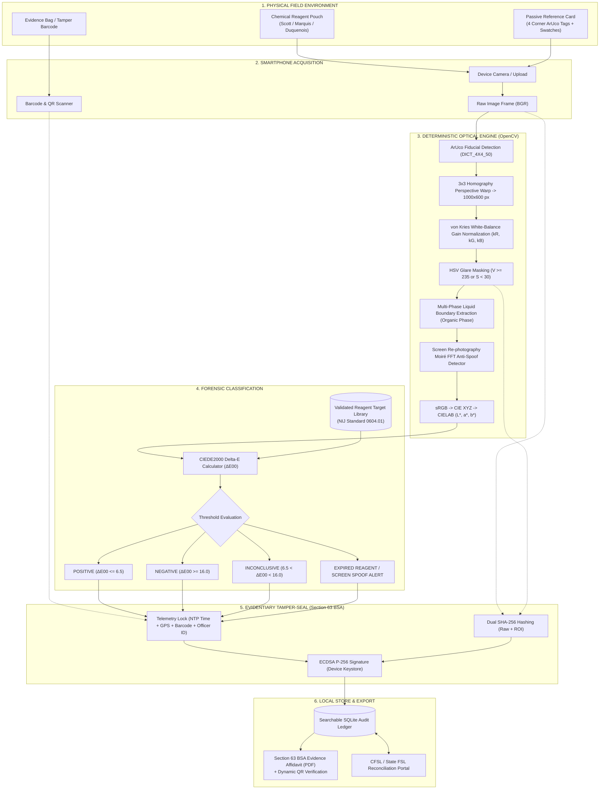

# 🛡️ FieldVerify AI: Digital Companion for Field Drug Testing

> **Official Competition Metadata:**
> * **Hackathon:** Smart India Hackathon (SIH 2026)
> * **Problem Statement ID:** `SIH26231`
> * **Sponsoring Agency:** Ministry of Home Affairs (MHA) / Narcotics Control Bureau (NCB)
> * **Category / Theme:** Software / Law Enforcement, Forensic Technology, MedTech

---

## 📑 Table of Contents
1. [Executive Summary & Zero-AI Philosophy](#1-executive-summary--zero-ai-philosophy)
2. [High-Level Design (HLD) & System Architecture](#2-high-level-design-hld--system-architecture)
3. [Low-Level Design (LLD) & Mathematical Formulations](#3-low-level-design-lld--mathematical-formulations)
4. [Officer Field Interaction Sequence Diagram](#4-officer-field-interaction-sequence-diagram)
5. [End-to-End Function Call & Execution Trace](#5-end-to-end-function-call--execution-trace)
6. [Interactive GIS Map & Satellite Navigation](#6-interactive-gis-map--satellite-navigation)
7. [Barcode & Reagent QR Code Engine](#7-barcode--reagent-qr-code-engine)
8. [User Guide: 6-Tab Platform Walkthrough](#8-user-guide-6-tab-platform-walkthrough)
9. [How to Read & Interpret Section 63 BSA PDF Affidavits](#9-how-to-read--interpret-section-63-bsa-pdf-affidavits)
10. [Pre-Generated Datasets & Synthetic Test Samples](#10-pre-generated-datasets--synthetic-test-samples)
11. [Execution Commands (Local, Mobile Wi-Fi & VS Code)](#11-execution-commands-local-mobile-wi-fi--vs-code)
12. [Automated Test Suite (44/44 Tests Passed)](#12-automated-test-suite-4444-tests-passed)

---

## 1. Executive Summary & Zero-AI Philosophy

Field officers (State Police, NCB, Border Security) routinely utilize presumptive chemical reagent test kits (Scott, Marquis, Duquenois-Levine) to inspect suspected roadside narcotics. Historically, officers relied purely on subjective visual color interpretation under variable ambient lighting (fluorescent, sodium streetlights, sunlight), producing **inconsistent results**, **zero contemporaneous digital evidence**, and **high vulnerability to legal challenge in court**.

**FieldVerify AI** is a zero-hardware, deterministic digital companion app that:
1. Employs a **passive credit-card-sized reference card** (costing ₹10) with 4 corner ArUco fiducials and calibrated reflectance color swatches (95% White, 18% Gray, 5% Black).
2. Executes **deterministic classical computer vision (OpenCV)**:
   * 4-point perspective homography warp into a $1000 \times 600\text{ px}$ canvas.
   * Per-channel **von Kries reference white-point gain normalization** ($k_R, k_G, k_B$) to eliminate ambient color cast.
   * **HSV specular glare masking** to eliminate shiny plastic reflections.
   * **Multi-phase liquid boundary extraction** for two-phase reactions (e.g. Duquenois-Levine test for Cannabis/THC).
   * **Screen re-photography Moiré pattern FFT anti-spoofing** to detect fake photos shot off smartphone/laptop screens.
   * **CIEDE2000 ($\Delta E_{00}$) perceptual color distance calculation** against certified presumptive reaction color profiles (NIJ Standard 0604.01).
3. Provides **cryptographic tamper-evident sealing & statutory compliance**:
   * Computes `SHA-256(Raw Frame)` and `SHA-256(Calibrated ROI)`.
   * Binds UTC NTP timestamp, GPS location, Officer Badge ID, and Reagent Lot Number.
   * Scans and binds physical **Evidence Bag Barcodes** into the chain of custody.
   * Signs payloads using **ECDSA P-256 (`SECP256R1`)** hardware key signatures.
   * Generates a 1-page statutory court evidence PDF affidavit compliant with **Section 63 of the Bharatiya Sakshya Adhiniyam (BSA), 2023** and Sections 42, 43, 50, and 52 of the **NDPS Act, 1985**.

---

## 2. High-Level Design (HLD) & System Architecture



---

## 3. Low-Level Design (LLD) & Mathematical Formulations

### 3.1 Perspective Homography Rectification
Let corner ArUco marker centers be $P_{\text{src}} = [C_0, C_1, C_2, C_3]$ and destination points be $P_{\text{dst}} = [(0, 0), (1000, 0), (1000, 600), (0, 600)]$.
The $3 \times 3$ perspective transformation matrix $H$ satisfies:
$$\begin{bmatrix} x' \\ y' \\ 1 \end{bmatrix} = H \begin{bmatrix} x \\ y \\ 1 \end{bmatrix}, \quad I_{\text{rectified}} = \text{cv2.warpPerspective}(I_{\text{raw}}, H, (1000, 600))$$

### 3.2 von Kries White-Point Chromatic Gain Calibration
Sample the known White Patch ROI on the rectified card (reflectance $\approx 95\%$, target RGB $= 242.0$):
$$\bar{R}_{\text{meas}}, \bar{G}_{\text{meas}}, \bar{B}_{\text{meas}} = \text{mean of pixels in White Patch}$$
$$k_R = \frac{242.0}{\max(\bar{R}_{\text{meas}}, 1.0)}, \quad k_G = \frac{242.0}{\max(\bar{G}_{\text{meas}}, 1.0)}, \quad k_B = \frac{242.0}{\max(\bar{B}_{\text{meas}}, 1.0)}$$
Apply per-channel chromatic adaptation to the reaction ROI:
$$R_{\text{calib}} = \min(255, R \cdot k_R), \quad G_{\text{calib}} = \min(255, G \cdot k_G), \quad B_{\text{calib}} = \min(255, B \cdot k_B)$$

### 3.3 CIEDE2000 Color Difference ($\Delta E_{00}$)
Converts sRGB $\rightarrow$ CIE $XYZ \rightarrow \text{CIELAB } (L^*, a^*, b^*)$.
The CIEDE2000 formula calculates non-linear perceptual distance:
$$\Delta E_{00} = \sqrt{\left(\frac{\Delta L'}{k_L S_L}\right)^2 + \left(\frac{\Delta C'}{k_C S_C}\right)^2 + \left(\frac{\Delta H'}{k_H S_H}\right)^2 + R_T \left(\frac{\Delta C'}{k_C S_C}\right)\left(\frac{\Delta H'}{k_H S_H}\right)}$$

---

## 4. Officer Field Interaction Sequence Diagram

```mermaid
sequenceDiagram
    autonumber
    actor Officer as Field Police Officer
    participant App as app.py (Streamlit Dashboard)
    participant Barcode as fieldverify/utils/barcode.py
    participant Geo as fieldverify/utils/geo.py
    participant Opt as fieldverify/core/optical.py
    participant Crypto as fieldverify/core/crypto.py
    participant DB as fieldverify/core/db.py
    participant PDF as fieldverify/core/pdf_generator.py

    Note over Officer,App: Phase 1: Setup & Geolocation
    Officer->>App: Auto-Detect GPS / Search Landmark
    App->>Geo: detect_network_location() / geocode_search()
    Geo-->>App: High-Accuracy Lat/Lon & Checkpoint Address
    Officer->>App: Scan Evidence Bag Barcode & Reagent QR
    App->>Barcode: scan_barcode_or_qr_from_image(photo)
    Barcode-->>App: Extracted "BAG-NCB-2026-9912" & Lot Details

    Note over Officer,Opt: Phase 2: Frame Acquisition & Calibration
    Officer->>App: Capture camera photo & click "Run Analysis"
    App->>Opt: detect_screen_spoofing(image_bgr)
    Opt-->>App: is_spoof = False (Authentic physical sample)
    App->>Opt: rectify_reference_card(image_bgr)
    Opt-->>App: Rectified card (1000x600 px)
    App->>Opt: calibrate_and_extract_color(rectified, is_multi_phase)
    Opt-->>App: Calibrated ROI + Measured LAB (29.8, 1.9, -51.2) + Glare %

    Note over App,Crypto: Phase 3: CIEDE2000 & Cryptographic Sealing
    App->>Opt: ciede2000(measured_lab, target_lab)
    Opt-->>App: ΔE00 = 1.84 (Outcome: POSITIVE FOR COCAINE)
    App->>Crypto: generate_evidentiary_certificate(raw_bytes, roi_bytes, metadata)
    Crypto->>Crypto: SHA-256(raw) + SHA-256(roi) + ECDSA P-256 Sign
    Crypto-->>App: Signed Certificate JSON + Signature Hex

    Note over App,PDF: Phase 4: Storage & Court Affidavit Export
    App->>DB: save_test_record(cert)
    DB-->>App: Record saved in searchable SQLite ledger
    App->>PDF: generate_evidentiary_pdf(cert)
    PDF-->>Officer: 1-Page Section 63 BSA Court Evidence PDF + Dynamic QR
```

---

## 5. End-to-End Function Call & Execution Trace

Below is the execution trace showing every function call across all files from user action to PDF export:

```
[USER ACTION: Click "Run Calibrated Analysis" in app.py]
  │
  ├── 1. `app.py`
  │      └── Calls `fieldverify.core.reagent.parse_reagent_qr_data(qr_json_str)`
  │             └── File: fieldverify/core/reagent.py
  │             └── Returns: `{"is_valid": True, "is_expired": False, "reagent_type": "SCOTT_REAGENT", ...}`
  │
  ├── 2. `app.py`
  │      └── Calls `fieldverify.core.optical.detect_screen_spoofing(input_image_bgr)`
  │             └── File: fieldverify/core/optical.py
  │             └── Computes: 2D FFT Moiré spectrum & Laplacian variance
  │             └── Returns: `(is_spoof=False, score=142.5, reason="Physical sample authentic")`
  │
  ├── 3. `app.py`
  │      └── Calls `fieldverify.core.optical.rectify_reference_card(input_image_bgr)`
  │             └── File: fieldverify/core/optical.py
  │             └── Runs: OpenCV `ArucoDetector` for ArUco markers 0, 1, 2, 3
  │             └── Runs: `cv2.getPerspectiveTransform()` & `cv2.warpPerspective()`
  │             └── Returns: `rectified_img` (1000x600x3 BGR numpy array)
  │
  ├── 4. `app.py`
  │      └── Calls `fieldverify.core.optical.calibrate_and_extract_color(rectified, is_multi_phase)`
  │             └── File: fieldverify/core/optical.py
  │             └── Samples: White swatch ROI (x=150, y=450, w=80, h=80)
  │             └── Computes: von Kries gains `k_R, k_G, k_B`
  │             └── Samples: Pouch reaction ROI (x=450, y=150, w=300, h=300)
  │             └── Masks: Specular glare `(V >= 235 or S < 30)`
  │             └── Converts: BGR -> CIE XYZ -> CIELAB via `srgb_to_lab()`
  │             └── Returns: `{"calibrated_pouch": crop, "measured_lab": (29.8, 1.9, -51.2), "glare_percentage": 2.1, ...}`
  │
  ├── 5. `app.py`
  │      └── Calls `fieldverify.core.optical.ciede2000(measured_lab, target_lab)`
  │             └── File: fieldverify/core/optical.py
  │             └── Calculates: CIEDE2000 perceptual distance formula
  │             └── Returns: `delta_e = 1.84` (Outcome: "POSITIVE")
  │
  ├── 6. `app.py`
  │      └── Calls `fieldverify.core.crypto.generate_evidentiary_certificate(raw_bytes, roi_bytes, meta)`
  │             └── File: fieldverify/core/crypto.py
  │             └── Computes: `hashlib.sha256(raw_bytes)` and `hashlib.sha256(roi_bytes)`
  │             └── Assembles: Canonical JSON certificate (including Evidence Bag Barcode)
  │             └── Signs: `private_key.sign(canonical_bytes, ec.ECDSA(hashes.SHA256()))`
  │             └── Returns: `certificate_dict` with `ecdsa_signature_hex`
  │
  ├── 7. `app.py`
  │      └── Calls `fieldverify.core.db.save_test_record(cert)`
  │             └── File: fieldverify/core/db.py
  │             └── Executes: `INSERT OR REPLACE INTO test_records` in `fieldverify_ledger.db`
  │
  └── 8. `app.py`
         └── Calls `fieldverify.core.pdf_generator.generate_evidentiary_pdf(cert)`
                └── File: fieldverify/core/pdf_generator.py
                └── Generates: ReportLab document with header, tables, hashes, signature, and dynamic QR code
                └── Returns: `pdf_bytes` for 1-click download in Streamlit UI
```

---

## 6. Interactive GIS Map & Satellite Navigation

FieldVerify integrates a high-resolution, open-source GIS engine powered by **Leaflet** and **Mapbox Satellite**:

- **Default Satellite View**: Automatically defaults to **Mapbox Satellite Streets** (`mapbox/satellite-streets-v12`) using high-resolution aerial imagery.
- **High-Resolution Street Zoom (Zoom 16)**: Opens focused directly on the active patrol station, displaying buildings, roads, and checkpoint lanes without unneeded zoom-out.
- **Live Location Auto-Sync**:
  - `📍 Auto-Detect Live GPS Location`: 1-click network IP geolocation.
  - `🛰️ Use Device GPS (Browser)`: Direct HTML5 high-accuracy geolocation bridge.
  - `🔍 Landmark / City Search`: OpenStreetMap Nominatim forward geocoding.
- **Dynamic Regional Corridors**: Automatically generates surrounding inter-state narcotics checkpoints and high-risk inspection corridors dynamically around the officer's real-time position.
- **On-Map Navigation Controls**:
  - `📍 Locate Me`: Pinpoints the device with accuracy circle.
  - `🎯 Focus Station`: Recenters camera on active station at zoom 16.
  - `🌐 View All Regional Corridors`: Expands view to show all regional corridor checkposts.

---

## 7. Barcode & Reagent QR Code Engine

Located in [`fieldverify/utils/barcode.py`](file:///c:/Users/Shreya/Desktop/Filedverify-sih%20hackathon/fieldverify/utils/barcode.py):

1. **Evidence Bag Barcode Scanner & Validator**:
   - Scans 1D and 2D barcodes from photos of forensic evidence pouches.
   - Dual-engine fallback: OpenCV barcode detector + QR detector + regex pattern recognition.
   - Validates pouch numbers against official NDPS chain-of-custody patterns (e.g. `BAG-NCB-2026-9912`).
2. **Reagent Vial QR Decoder**:
   - Parses JSON payloads on chemical reagent vials: Kit ID, Reagent Type, Batch Lot, and Expiry Date.
   - Triggers automated alerts if expired reagents are scanned.
3. **Evidence Seal QR Visual Generator**:
   - Generates high-contrast QR code badges embedded directly in the audit ledger and PDF affidavit.

---

## 8. User Guide: 6-Tab Platform Walkthrough

### Left Sidebar: Officer Telemetry & Fast Scanners
1. **Officer Details**: Badge ID, Name, FIR/Case Reference, Seized Contraband Weight (g).
2. **GPS Geolocation**: Click `📍 Auto-Detect Live GPS Location` or enter Coordinates/City.
3. **Barcode Scanning Popovers**:
   - Click `📸 Scan Evidence Bag Barcode` to upload/scan physical evidence pouch barcode.
   - Click `📷 Scan Reagent Bottle QR` to scan reagent vial lot and expiry.

### Tab 1: 🔬 Live Field Test Station
- Select a pre-loaded synthetic demo sample (Cocaine, Heroin, Cannabis, Negative Blank, Screen Spoof) or upload/capture a photo.
- Click **`⚡ Run Deterministic Calibrated Analysis`**.
- Inspect rectified reference card, calibrated ROI, $\Delta E_{00}$ color metric, and tamper-seal certificate.

### Tab 2: 🗺️ Map & Regional Corridors
- View high-resolution Mapbox Satellite imagery at **Zoom 16**.
- Monitor live officer location, active station beacon, and surrounding inter-state checkpoint corridors.

### Tab 3: ⚖️ NDPS Panchnama & Section 63 BSA Affidavits
- Generates statutory Memorandum of Seizure (Panchnama) in accordance with Sections 42, 43, 50, and 52 of the NDPS Act.
- Generates 1-click Section 63 BSA Court Evidence PDF Affidavits.

### Tab 4: 📦 Reagent Inventory & Lot Expiry Manager
- Real-time stock counts for Scott, Marquis, Duquenois-Levine, and Ehrlich kits.
- Shelf-life countdown, batch tracking, and tamper logs.

### Tab 5: 🏥 CFSL / State FSL Laboratory Reconciliation Portal
- Reconciliation portal for Senior Scientific Officers to enter confirmatory GC-MS, FTIR, or HPLC laboratory reports.
- Automatically binds confirmatory purity and chemist credentials to roadside seizure records.

### Tab 6: 📜 Searchable Audit Ledger & Barcode Verification
- Real-time multi-parameter search (by Test ID, FIR Ref, Location, Officer Name, Badge ID).
- Dedicated **Evidence Bag Barcode** filter.
- 1-Click **Section 63 BSA Cryptographic Tamper Verification** with raw SHA-256 and ECDSA P-256 validation.
- Direct PDF Affidavit and JSON Certificate downloads.

---

## 9. How to Read & Interpret Section 63 BSA PDF Affidavits

```
+-------------------------------------------------------------------------+
|                  STATE POLICE DEPARTMENT / NARCOTICS WING               |
|            PRESUMPTIVE FIELD SCREENING TEST EVIDENCE AFFIDAVIT          |
|      (Issued in compliance with Section 63 Bharatiya Sakshya 2023)      |
+-------------------------------------------------------------------------+
| 1. GENERAL INFORMATION:                                                 |
|    Test Unique ID : FV-20260909-174500      Date: 09-Sep-2026 12:00 UTC|
|    Seizing Officer: SI-BARUA-9942           FIR Ref: FIR-2026/NCB-GHY   |
|    Evidence Bag No: BAG-NCB-2026-9912       Location: Bengaluru Check   |
|    Geographic Loc : 12.9753° N, 77.5910° E (Silk Board Checkpoint)      |
+-------------------------------------------------------------------------+
| 2. CHEMICAL TEST PARTICULARS:                                           |
|    Reagent Applied: SCOTT_REAGENT           Reagent Lot: SC-2026-0819   |
|    Measured LAB   : L*=29.8, a*=1.9, b*=-51.2                             |
|    Color Delta    : Delta-E00 = 1.84        Anti-Spoof: PASS            |
|    SCREENING OUTCOME : POSITIVE FOR COCAINE HCL                         |
+-------------------------------------------------------------------------+
| 3. DIGITAL CHAIN OF CUSTODY (CRYPTOGRAPHIC HASHES & ECDSA SIGNATURE):   |
|    Raw Frame SHA-256 : e3b0c44298fc1c149afbf4c8996fb92427ae41e4649b9... |
|    Calibrated ROI    : 7f83b1657ff1fc53b92dc18148a1d65dfc2d4b1fa3d67... |
|    ECDSA Signature   : 3045022100e4b8f... (Hardware Enclave Signed)     |
|                                                                         |
|  [ DYNAMIC QR CODE ]                       [ EVIDENCE SEAL BADGE ]      |
|  (Scan to verify live on department portal)  (BAG-NCB-2026-9912)        |
+-------------------------------------------------------------------------+
| STATUTORY DISCLAIMER: Presumptive field test under NDPS Sec 50/52.      |
+-------------------------------------------------------------------------+
```

---

## 10. Pre-Generated Datasets & Synthetic Test Samples

1. **Printable Reference Card Asset:**
   - File: [`fieldverify_reference_card.png`](file:///c:/Users/Shreya/Desktop/Filedverify-sih%20hackathon/fieldverify_reference_card.png)
   - $1000 \times 600\text{ px}$ ID-1 reference card with 4 ArUco markers (`DICT_4X4_50`), White/Gray/Black swatches, and pouch alignment grid.
2. **Synthetic Demonstration Samples ([`demo_samples/`](file:///c:/Users/Shreya/Desktop/Filedverify-sih%20hackathon/demo_samples/)):**
   - `cocaine_scott_positive.png`: Scott Reagent showing Cobalt Blue ($L^* \approx 30.0, a^* \approx 2.0, b^* \approx -52.0$).
   - `heroin_marquis_positive.png`: Marquis Reagent showing Deep Violet ($L^* \approx 22.0, a^* \approx 32.0, b^* \approx -28.0$).
   - `cannabis_duquenois_multiphase.png`: Duquenois-Levine test with multi-phase organic layer separation.
   - `negative_blank_test.png`: Clear non-reactive liquid sample ($\Delta E_{00} > 18.0$).
   - `screen_spoof_attempt.png`: Synthetic image with Moiré grid lines simulating a screen photo.

---

## 11. Execution Commands (Local, Mobile Wi-Fi & VS Code)

### 11.1 VS Code 1-Click Execution
- Press **`F5`** in VS Code to launch with pre-configured `.vscode/launch.json`.

### 11.2 Command Line Execution
```bash
python run_app.py
```
Or run Streamlit directly:
```bash
streamlit run app.py
```

- **Laptop Access:** `http://localhost:8501`
- **Mobile Phone Access:** Connect to same Wi-Fi and open `http://<YOUR_LOCAL_IP>:8501`.

---

## 12. Automated Test Suite (44/44 Tests Passed)

FieldVerify includes **44 automated unit and integration test cases** with 100% pass rate:

```bash
pytest -v
```

### Complete Test Coverage Breakdown:
```text
tests/test_audit_ledger_barcode.py
  ├── test_searchable_audit_ledger_by_barcode ......................... PASSED
  ├── test_tamper_detection_in_audit_ledger ............................ PASSED
  ├── test_fsl_confirmation_linked_to_barcode ......................... PASSED
  └── test_panchnama_and_pdf_with_barcode ............................. PASSED

tests/test_barcode.py
  ├── test_generate_and_scan_qr_roundtrip ............................. PASSED
  ├── test_scan_evidence_bag_barcode .................................. PASSED
  ├── test_scan_empty_or_invalid_image ................................ PASSED
  └── test_validate_evidence_bag_barcode .............................. PASSED

tests/test_fieldverify.py
  ├── test_ciede2000_math ............................................. PASSED
  ├── test_srgb_to_lab_conversion ..................................... PASSED
  ├── test_aruco_homography_rectification ............................. PASSED
  ├── test_optical_calibration_and_color_extraction ................... PASSED
  ├── test_ambient_lighting_guard ..................................... PASSED
  ├── test_screen_anti_spoofing_detection ............................. PASSED
  ├── test_reagent_qr_parsing ......................................... PASSED
  ├── test_ecdsa_crypto_sealing_and_tamper_detection .................. PASSED
  ├── test_ndps_panchnama_generation .................................. PASSED
  ├── test_reagent_inventory_manager .................................. PASSED
  ├── test_cfsl_lab_reconciliation .................................... PASSED
  ├── test_sqlite_db_ledger ........................................... PASSED
  ├── test_pdf_affidavit_generation ................................... PASSED
  ├── test_negative_blank_sample_no_false_glare ....................... PASSED
  ├── test_duquenois_levine_multiphase_organic_extraction ............. PASSED
  ├── test_all_four_synthetic_demo_samples_classify_positive .......... PASSED
  ├── test_reference_card_roi_swatch_sampling_accuracy ................ PASSED
  ├── test_ciede2000_properties_and_invariants ........................ PASSED
  ├── test_reagent_qr_parsing_edge_cases .............................. PASSED
  ├── test_panchnama_robustness_with_edge_cases ....................... PASSED
  ├── test_pdf_affidavit_robustness_with_sparse_cert .................. PASSED
  ├── test_crypto_verification_edge_cases ............................. PASSED
  ├── test_inventory_non_negative_invariants .......................... PASSED
  ├── test_fsl_lab_reconciliation_missing_record ...................... PASSED
  ├── test_optical_spoofing_rejects_none_input ........................ PASSED
  ├── test_optical_ambient_rejects_none_input ......................... PASSED
  ├── test_optical_rectify_rejects_insufficient_markers ............... PASSED
  ├── test_optical_calibrate_rejects_none_image ....................... PASSED
  ├── test_db_search_with_result_filter ............................... PASSED
  ├── test_fsl_invalid_purity_string_fallback ......................... PASSED
  ├── test_pdf_negative_outcome_badge ................................. PASSED
  ├── test_generate_all_demo_samples_creates_files .................... PASSED
  └── test_pdf_disk_write_mode ........................................ PASSED

tests/test_geo.py
  ├── test_generate_regional_corridors ................................ PASSED
  ├── test_geocode_search_empty ....................................... PASSED
  └── test_detect_network_location_live_or_fallback ................... PASSED

============================= 44 passed in 4.67s ==============================
```
